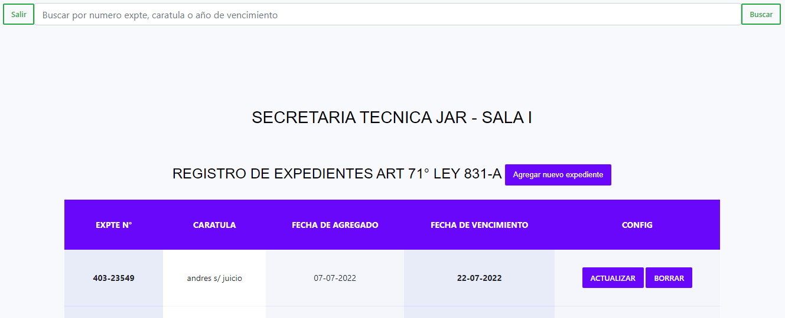

# Java - Spring Boot (Proyecto: API REST) 

## Desarrollado por 🖥️  [AndresRodriguez](https://www.linkedin.com/in/andres-rodriguez-60a166208/) - [GitHub](https://github.com/AndrRod) - [PortFolio](https://andresporfolio.herokuapp.com/)

### Objetivo

Proyecto API REST - El objeto es crear el backed para una página web basica desarrollada con React que sirve para almacenar expedientes y llevar un registro de vencimiento de los mismos, se uso spring security y jwt para evitar que cualquiera pueda ingresar.

### Herramientas utilizadas
- 👉 Java y Spring Boot
- 👉 Librería Spring Security
- 👉 Encriptación de contraseñas (PasswordEncoder)
- 👉 Utilización de tokens para validar usuario.
- 👉 Manejo de Excepciones 
- 👉 Utilización de DTOs 
- 👉 Soft delete (borrado logico)

# Dirección URL del frontend en producción
https://regist-exp.netlify.app/

# Dirección URL del backend en producción
https://registro-exp.herokuapp.com

### VIDEO DEMOSTRATIVO.
https://youtu.be/S8m4_HPJg4k

### FRONTEND VISTA PREVIA.

